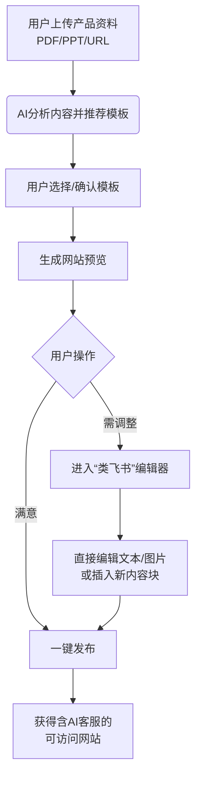

# LeadSite AI - 产品需求文档 (MVP)

## 1. 产品概述

### 1.1 产品名称
**LeadSite AI**

### 1.2 产品定位与核心价值
面向B2B及跨境电商卖家的AI Growth Partner。核心价值是**将用户现有的产品资料（PDF/PPT/URL）在几分钟内自动转化为一个带AI智能客服、SEO友好的独立站**，旨在快速建立海外专业形象并获取高质量询盘。

### 1.3 目标用户
1.  **主要用户**：需要向海外客户展示专业产品与公司实力的B2B企业（如外贸工厂、工贸一体企业）。
2.  **次要用户**：希望快速建立品牌独立站以承载流量的跨境电商卖家。

## 2. 核心产品流程
用户的核心使用旅程如下：

## 3. 详细功能规格

### 3.1 中央AI工作台
*   **功能描述**：产品首页的核心交互区域。
*   **交互与需求**：
    1.  提供一个显著的**输入对话框**，支持：
        *   **文件拖拽/上传**：支持 PDF, PPT, DOCX 格式。
        *   **网址输入**：输入现有网站URL进行内容抓取与分析。
        *   **文本粘贴**：直接粘贴公司或产品描述文本。
    2.  对话框内提供**示例提示**（如：“上传产品手册，生成一个英文工业品官网”），引导用户输入。

### 3.2 智能模板推荐与选择
*   **功能描述**：根据资料内容动态推荐网站模板。
*   **交互与需求**：
    1.  在AI对话框下方，以**网格形式**展示3-5个推荐模板。
    2.  模板推荐逻辑应基于AI对上传资料的**行业识别**（如工业、科技、消费品）和**内容分析**。
    3.  每个模板需清晰标注**风格**（如“极简专业”、“视觉冲击”）与**适用场景**（如“B2B企业官网”、“DTC品牌”）。
    4.  用户可点击选择推荐模板，也可浏览并选择全部模板库中的其他模板。

### 3.3 网站生成与预览
*   **功能描述**：根据资料和模板生成完整的网站并预览。
*   **交互与需求**：
    1.  生成后，全屏展示网站**预览效果**，模拟真实浏览器访问。
    2.  预览页面提供明确的 **“编辑”** 和 **“发布”** 按钮。
    3.  生成的网站应至少包含：首页(Home)、产品/服务页(Products)、关于我们(About)、联系我们(Contact)。

### 3.4 “类飞书”块编辑器（核心交互）
*   **功能描述**：提供直观的页面内容编辑体验。
*   **交互与需求**：
    1.  点击“编辑”后，进入编辑模式，交互方式类似 **飞书文档** 或 **Notion**。
    2.  **直接编辑**：用户可以直接点击预览页面上的**任何文本**进行修改，点击**图片**进行替换。
    3.  **块操作**：
        *   支持通过右键菜单或浮动工具栏**插入新内容块**（如文本、按钮、图片、标题）。
        *   支持通过拖拽手柄调整内容块的上下顺序。
    4.  **页面管理**：左侧栏显示**网站页面缩略图列表**，支持点击切换、拖拽排序。
    5.  **AI重生成**：在编辑器内，用户可针对当前页面或选定内容块，唤出AI指令框，输入新指令（如：“让这段话更简洁”、“基于新资料重写产品描述”）进行局部优化。

### 3.5 集成AI客服 (AI Bot)
*   **功能描述**：为生成的网站自动配置一个智能客服机器人。
*   **交互与需求**：
    1.  网站生成时，后台自动基于用户上传的**全部资料**构建AI Bot的知识库。
    2.  在网站编辑模式下，提供 **“AI客服配置”** 侧边面板。
    3.  面板内允许用户修改Bot的**欢迎语**、**名称**，并管理一些基础问答对。
    4.  生成的网站上，Bot以**右下角悬浮图标**形式存在。

### 3.6 一键部署与SEO基础
*   **功能描述**：将最终网站部署上线，并确保对搜索引擎友好。
*   **交互与需求**：
    1.  点击 **“发布”** 按钮，后台自动将网站静态文件部署至云服务。
    2.  系统为用户分配一个临时的免费子域名：`[项目名].leadsite.ai`。
    3.  提供清晰的指引，说明如何绑定**自定义域名**。
    4.  **SEO基础**：生成的网站代码需：
        *   自动为每个页面生成合理的 `<title>` 和 `<meta description>` 标签。
        *   输出规范的HTML语义化结构。
        *   生成 `sitemap.xml` 文件。

## 4. 非功能性需求

### 4.1 性能需求
*   从用户上传文件到生成网站预览，平均时间应 **< 2分钟**。
*   生成的网站页面加载速度（LCP）应优于2秒。

### 4.2 技术栈建议 (MVP)
| 层级 | 技术选择 | 说明 |
| :--- | :--- | :--- |
| **前端/全栈框架** | Next.js 14 (App Router) | 服务端渲染对SEO友好，API Routes方便集成后端逻辑，简化全栈开发。 |
| **样式方案** | Tailwind CSS | 实用性强，能快速构建美观、响应式的界面。 |
| **块编辑器** | Plate (@udecode/plate) | 基于Slate，提供强大的“类飞书”块编辑体验，插件生态丰富。 |
| **AI集成** | OpenAI GPT-4o API | 通过Next.js API Routes调用，处理内容理解、生成和Bot对话逻辑。 |
| **部署平台** | Vercel | 对Next.js应用支持最佳，实现自动化部署和全球CDN加速。 |

### 4.3 成功指标 (MVP验证阶段)
1.  **流程完成率**：70%的测试用户能独立完成从上传到发布的全流程。
2.  **内容准确率**：AI从资料中提取的关键信息（产品规格、公司介绍）准确率 > 85%。
3.  **可用性评分**：通过用户调研，生成网站的整体可用性评分（SUPR-Q）达到平均7分（满分10分）以上。

---
*PRD文档版本：V1.0 (MVP)*
